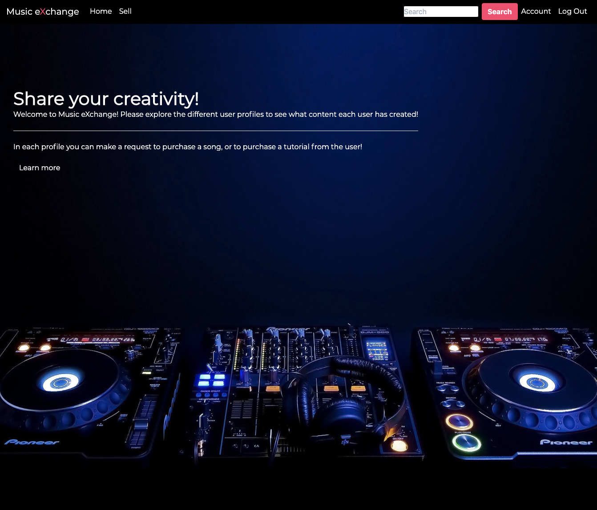
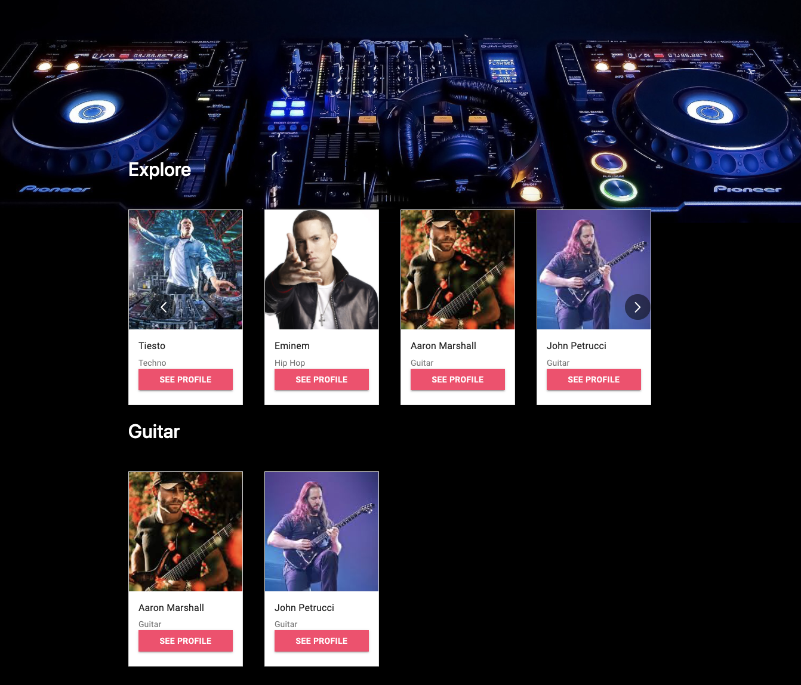
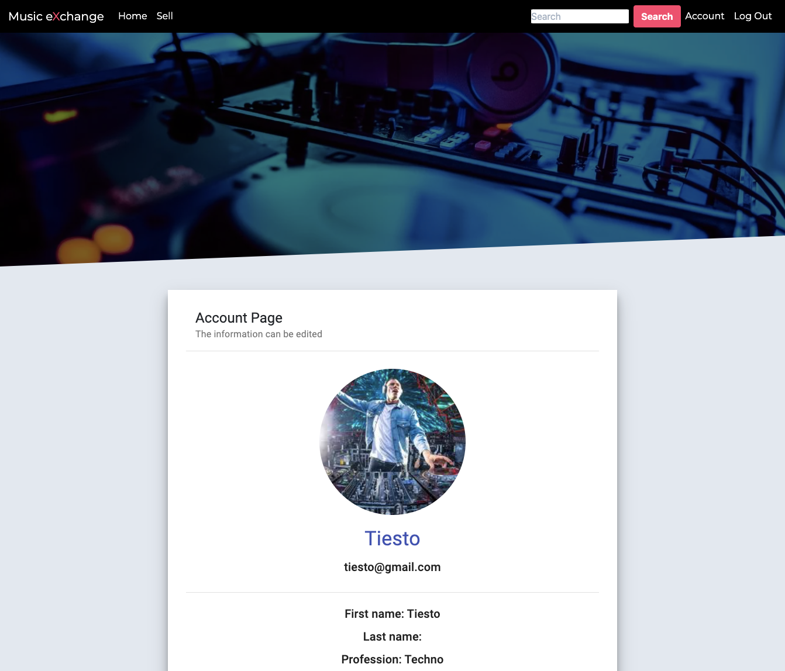
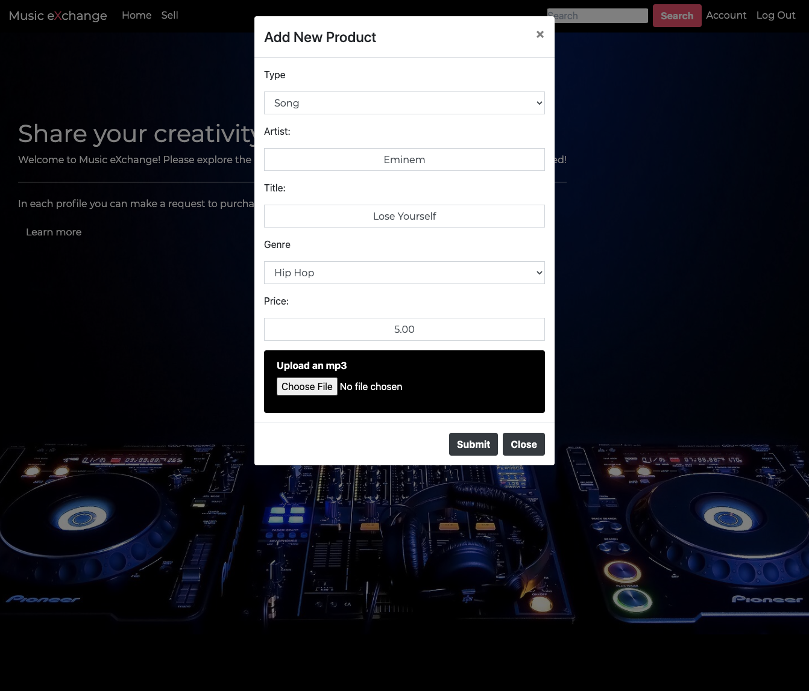
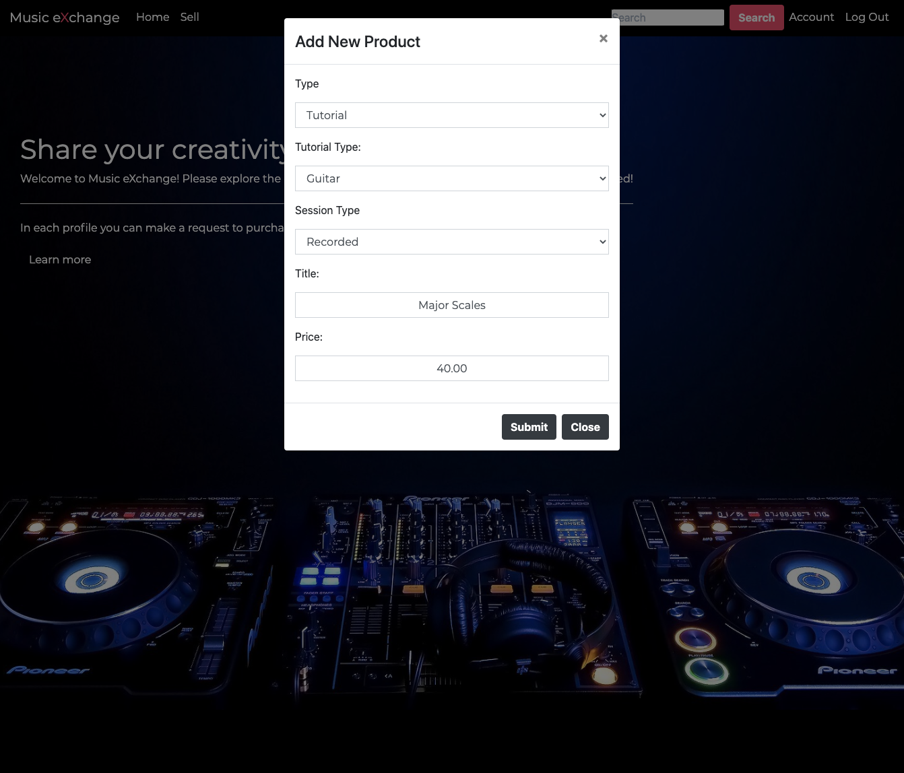

# Music eXchange 
(Under construction)

## Authors
Nick Guimarais, Juhee Kim, Dustin Scroggins, Edward Reyes

## Tables of Contents
* [User-Story](#user-story)

* [Technologies](#technologies)

* [Contributions](#contributions)

* [Installation](#installation)

* [Deployment](#Deployment)

## User-Story
* I want an application that I can use to build a portfolio of music and offer my services to fans and anyone who wants to learn something for a fee. 

* As an artist or fan, I open the application and I am presented with a login screen to input my credentials.  As an artist, I will be directed to my profile management page.  As a fan, I will have the ability to search for an artist and and submit requests or purchase new material.

* When we look at an artist’s profile we are presented with a biography of information including contact information (determined by the artist or their management) and a list of songs for sale.  We are also presented with the ability to submit a request for a recorded tutorial and/or a live recording from the artist

* The artist receives the request from the user at which point they have the ability to negotiate their fee and book a time and date with the artist. 

* When a fee is determined, the artist will record their tutorial (either with youtube, or another video/production studio) and submit it directly to the user.

* The user will be notified that the artist has completed their request and the tutorial will be delivered when the fee has been processed.

* This program allows artists to have a direct relationship with their fans without the ability to perform live. 

## Technologies
MERN

### Frontend:
HTML, CSS, JavaScript, React Bootstrap, React, Parallax, Calendly, React Media Players, Material-UI

### Backend:
Node.js, Express, Mongo, Mongoose, Cloudinary

## Contributions

## Frontend
Juhee Kim, Dustin Scroggins
* Design landing page that allows users to input their login info
* Design the user profiles and artist profiles
* Design checkout area for song purchases/transactions
* Create a search bar that allows a user to search for any profile and navigate to that page. 
* Create media player to play demo songs, and songs purchased by the user. 
* Create front-end routes to submit forms and send requests to the backend

## Backend
Nick Guimarais, Edward Reyes
* Create HTML and API routes to visit user profiles, purchase songs, save favorite users, save songs, and create and save requests.
* Create User’s table that stores information for each user
* Create songs table and schema
* Create purchased songs array that stores the purchased songs
* Create table and schema for tutorials
* Create routes and controller functions to allow a user to edit their profile* 

## Installation

To install the necessary dependencies:

```
npm i
```

## Deployment
Most recent deployment linK: (site still work in progress)
[Visit our site](https://arcane-everglades-49918.herokuapp.com/)

Screenshots below are the current changes yet to be deployed

## Home page

## View other Music eXchange Members

## View member profiles and purchase thier music!

## Sell Songs!

## Sell Tutorials


